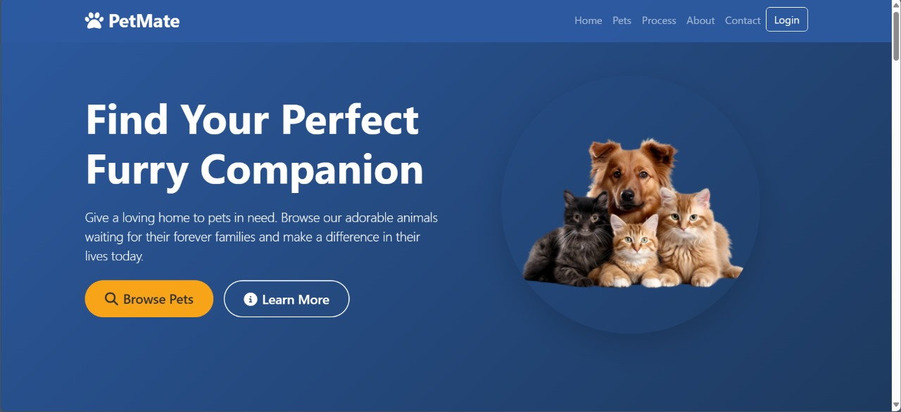
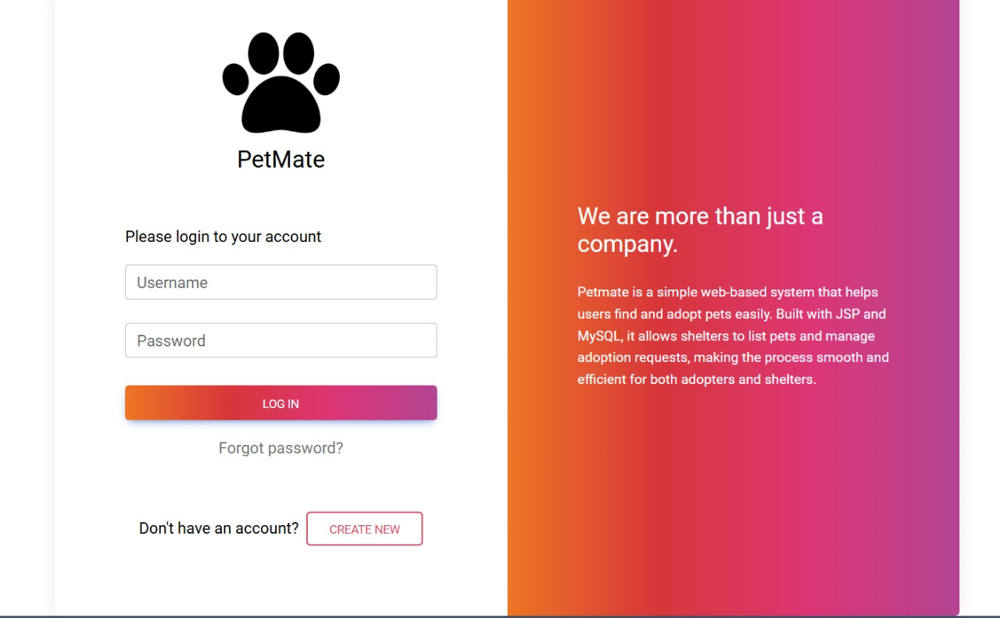
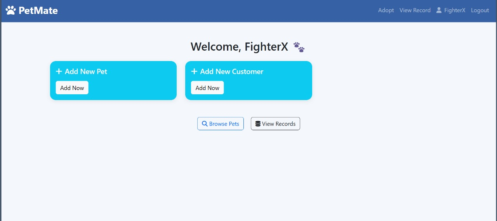
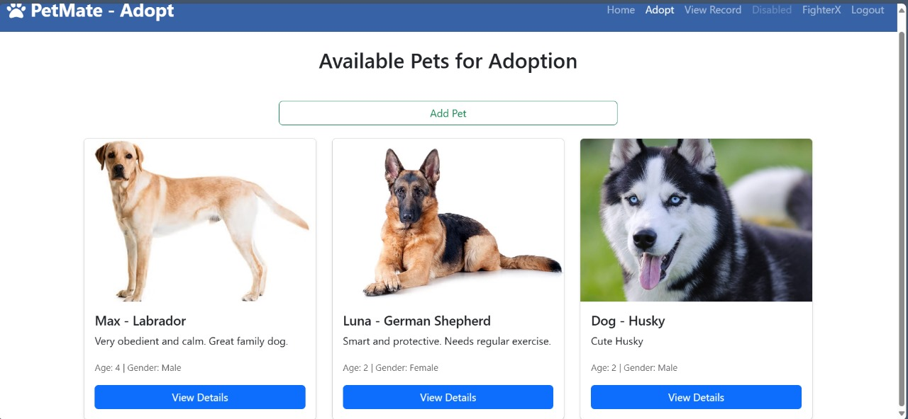
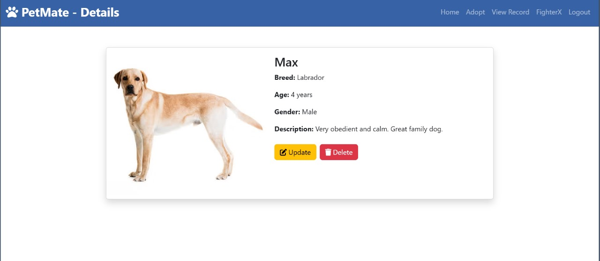
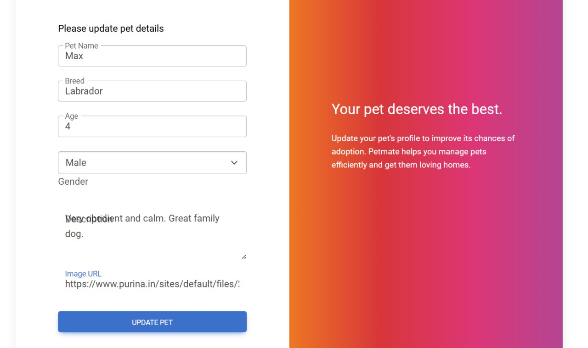
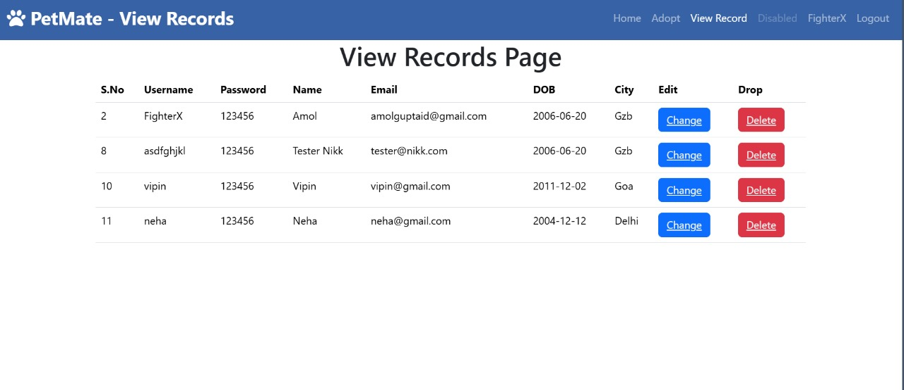

# 🐾 PetMate – Pet Adoption System

**PetMate** is a web-based pet adoption platform that helps users find and adopt pets easily.  
Built using **JSP** and **MySQL**, it allows shelters to manage pet listings and adoption records through a clean and user-friendly interface.

---

## 🚀 Features

- 🔐 User login and authentication
- 🐶 Browse pets with images and descriptions
- 📋 Add, update, and delete pet details (Admin only)
- 👤 Manage user records
- 📄 Detailed pet profiles for informed adoption
- 💻 Responsive and modern design using HTML, CSS, Bootstrap

---

## 💻 Tech Stack

- **Frontend**: HTML5, CSS3, Bootstrap
- **Backend**: JSP (Java Server Pages)
- **Database**: MySQL
- **Server**: Apache Tomcat

---

## 📸 Screenshots

### 🏠 Homepage  


### 🔐 Login Page  


### 👋 Welcome Dashboard  


### 🐕 Browse Pets  


### 📄 Pet Details  


### ✏️ Update Pet  


### 📋 User Records  


---

## 🛠️ How to Run Locally

1. **Clone the repository**
   ```bash
   git clone https://github.com/FighterX777/petmate.git
   ```

2. **Import into your IDE**
   - Use **Eclipse**, **NetBeans**, or **IntelliJ**
   - Import the project as a **Dynamic Web Project**

3. **Set up the MySQL Database**
   - Create a database named `pet_adopt`
   - Import the `pet_adopt.sql` file 

4. **Configure Database Connection**
   - Edit DB credentials in the `UserDAO` classes

5. **Run the Project**
   - Deploy the project on **Apache Tomcat Server**
   - Open your browser and go to:
     ```
     http://localhost/petmate
     ```

---

## 👤 Developer

- **Amit Singh**

---

## 📜 License

This project is open-source and free to use for educational and non-commercial purposes.

---

## 🌟 Support

If you found this project helpful, please give it a ⭐ on GitHub and share it with others!


---

## 📝 System Pseudocode

### **Database Layer (UserDAO.java)**

#### User Management Operations

```
FUNCTION Register(userBean)
    CONNECT to database
    PREPARE SQL: INSERT user data (username, password, name, email, dob, city)
    BIND userBean properties to SQL parameters
    EXECUTE insert query
    RETURN status (success/failure)
END FUNCTION

FUNCTION Login(userBean)
    CONNECT to database
    PREPARE SQL: SELECT user WHERE username AND password match
    BIND credentials to SQL parameters
    EXECUTE query
    IF user found THEN
        CREATE userBean object
        SET username and role
        RETURN userBean
    ELSE
        RETURN null
    END IF
END FUNCTION

FUNCTION Show()
    CONNECT to database
    EXECUTE SQL: SELECT all users
    RETURN ResultSet of all users
END FUNCTION

FUNCTION Update(userBean)
    CONNECT to database
    PREPARE SQL: UPDATE user SET all fields WHERE username matches
    BIND userBean properties to SQL parameters
    EXECUTE update query
    RETURN status
END FUNCTION

FUNCTION Delete(username)
    CONNECT to database
    PREPARE SQL: DELETE user WHERE username matches
    BIND username to SQL parameter
    EXECUTE delete query
    RETURN status
END FUNCTION

FUNCTION MakeAdmin(username)
    CONNECT to database
    PREPARE SQL: UPDATE user SET role='admin' WHERE username matches
    EXECUTE update query
    RETURN status
END FUNCTION
```

#### Pet Management Operations

```
FUNCTION GetAllPets()
    CONNECT to database
    EXECUTE SQL: SELECT all pets
    RETURN ResultSet of all pets
END FUNCTION

FUNCTION GetPetById(petId)
    CONNECT to database
    PREPARE SQL: SELECT pet WHERE id matches
    BIND petId to SQL parameter
    EXECUTE query
    RETURN ResultSet of pet details
END FUNCTION

FUNCTION InsertPet(petBean)
    CONNECT to database
    PREPARE SQL: INSERT pet (name, breed, age, gender, description, image)
    BIND petBean properties to SQL parameters
    EXECUTE insert query
    RETURN status
END FUNCTION

FUNCTION UpdatePet(petBean)
    CONNECT to database
    PREPARE SQL: UPDATE pet SET all fields WHERE id matches
    BIND petBean properties to SQL parameters
    EXECUTE update query
    RETURN status
END FUNCTION

FUNCTION DeletePet(petId)
    CONNECT to database
    PREPARE SQL: DELETE pet WHERE id matches
    EXECUTE delete query
    RETURN status
END FUNCTION
```

#### Adoption Management Operations

```
FUNCTION AdoptPet(username, petId)
    CONNECT to database
    PREPARE SQL: INSERT adoption record (username, petId, timestamp)
    BIND parameters to SQL
    EXECUTE insert query
    RETURN status
END FUNCTION

FUNCTION IsPetAlreadyAdopted(petId)
    CONNECT to database
    PREPARE SQL: SELECT adoption WHERE petId matches
    EXECUTE query
    IF record exists THEN
        RETURN 1 (adopted)
    ELSE
        RETURN 0 (available)
    END IF
END FUNCTION

FUNCTION IsPetAdoptedByUser(username, petId)
    CONNECT to database
    PREPARE SQL: SELECT adoption WHERE username AND petId match
    EXECUTE query
    IF record exists THEN
        RETURN 1 (user adopted this pet)
    ELSE
        RETURN 0 (not adopted by user)
    END IF
END FUNCTION

FUNCTION GetPetAdopter(petId)
    CONNECT to database
    PREPARE SQL: SELECT username FROM adoptions WHERE petId matches
    EXECUTE query
    IF found THEN
        RETURN adopter username
    ELSE
        RETURN null
    END IF
END FUNCTION

FUNCTION GetAdoptedPets(username)
    CONNECT to database
    PREPARE SQL: SELECT adoptions JOIN pets WHERE username matches
    EXECUTE query
    RETURN ResultSet of adopted pets with details
END FUNCTION

FUNCTION GetAdoptedPets() // Admin version
    CONNECT to database
    PREPARE SQL: SELECT adoptions JOIN pets JOIN users
    EXECUTE query
    RETURN ResultSet of all adoptions with pet and adopter details
END FUNCTION

FUNCTION GetAdoptionCount(username)
    CONNECT to database
    PREPARE SQL: COUNT adoptions WHERE username matches
    EXECUTE query
    RETURN count
END FUNCTION

FUNCTION GetTotalAdoptionCount()
    CONNECT to database
    PREPARE SQL: COUNT all adoptions
    EXECUTE query
    RETURN total count
END FUNCTION

FUNCTION DeleteAdoption(adoptionId)
    CONNECT to database
    PREPARE SQL: DELETE adoption WHERE id matches
    EXECUTE delete query
    RETURN status
END FUNCTION
```

#### Feedback Management Operations

```
FUNCTION InsertFeedback(username, message)
    CONNECT to database
    PREPARE SQL: INSERT feedback (username, message)
    BIND parameters to SQL
    EXECUTE insert query
    RETURN status
END FUNCTION

FUNCTION GetAllFeedback()
    CONNECT to database
    EXECUTE SQL: SELECT all feedbacks ORDER BY timestamp DESC
    RETURN ResultSet of feedbacks
END FUNCTION

FUNCTION DeleteFeedback(feedbackId)
    CONNECT to database
    PREPARE SQL: DELETE feedback WHERE id matches
    EXECUTE delete query
    RETURN status
END FUNCTION
```

---

### **Presentation Layer (JSP Pages)**

#### User Authentication Flow

```
PAGE: login.jsp
    DISPLAY login form
    ON SUBMIT:
        SEND credentials to log.jsp
    END ON SUBMIT
END PAGE

PAGE: log.jsp
    RECEIVE username and password from form
    CREATE userBean with credentials
    CALL UserDAO.Login(userBean)
    IF login successful THEN
        CREATE session with username and role
        IF role is 'admin' THEN
            REDIRECT to AdminDash.jsp
        ELSE
            REDIRECT to UserDash.jsp
        END IF
    ELSE
        SHOW error message
        REDIRECT to login.jsp
    END IF
END PAGE

PAGE: registration.jsp
    DISPLAY registration form (username, password, name, email, dob, city)
    ON SUBMIT:
        SEND data to reg.jsp
    END ON SUBMIT
END PAGE

PAGE: reg.jsp
    RECEIVE all user details from form
    CREATE userBean with all properties
    CALL UserDAO.Register(userBean)
    IF registration successful THEN
        SHOW success message
        REDIRECT to login.jsp
    ELSE
        SHOW error message
    END IF
END PAGE

PAGE: logout.jsp
    INVALIDATE session
    REDIRECT to login.jsp
END PAGE
```

#### User Dashboard Flow

```
PAGE: UserDash.jsp
    CHECK if session exists
    IF no session THEN
        REDIRECT to login.jsp
    END IF
    
    GET username from session
    CALL UserDAO.GetAdoptionCount(username)
    
    DISPLAY:
        - Welcome message with username
        - Adoption count card
        - Feedback option card
        - Adopt pet option card
        - Navigation menu (Adopt, Feedbacks, Logout)
    END DISPLAY
END PAGE

PAGE: adoptpet.jsp
    CHECK session
    CALL UserDAO.GetAllPets()
    FOR EACH pet in ResultSet DO
        DISPLAY pet card with:
            - Pet image
            - Pet name, breed, age, gender
            - Description
            - Adopt button
        END DISPLAY
    END FOR
END PAGE

PAGE: petdetails.jsp
    CHECK session
    GET petId from request parameter
    CALL UserDAO.GetPetById(petId)
    CALL UserDAO.IsPetAlreadyAdopted(petId)
    
    DISPLAY:
        - Full pet details
        - IF pet not adopted THEN
            SHOW "Adopt Now" button
        ELSE
            SHOW "Already Adopted" message
        END IF
    END DISPLAY
END PAGE

PAGE: adoptaction.jsp
    CHECK session
    GET username from session
    GET petId from request parameter
    
    CALL UserDAO.IsPetAlreadyAdopted(petId)
    IF pet already adopted THEN
        SHOW error message
        REDIRECT back
    ELSE
        CALL UserDAO.AdoptPet(username, petId)
        IF successful THEN
            SHOW success message
            REDIRECT to viewadoptions.jsp
        ELSE
            SHOW error message
        END IF
    END IF
END PAGE

PAGE: viewadoptions.jsp
    CHECK session
    GET username from session
    CALL UserDAO.GetAdoptedPets(username)
    
    FOR EACH adoption in ResultSet DO
        DISPLAY:
            - Pet details
            - Adoption date
            - Cancel adoption button
        END DISPLAY
    END FOR
END PAGE

PAGE: deleteadoption.jsp
    CHECK session
    GET adoptionId from request parameter
    CALL UserDAO.DeleteAdoption(adoptionId)
    REDIRECT to viewadoptions.jsp
END PAGE

PAGE: feedback.jsp
    CHECK session
    DISPLAY feedback form
    ON SUBMIT:
        GET username from session
        GET message from form
        CALL UserDAO.InsertFeedback(username, message)
        SHOW success message
    END ON SUBMIT
END PAGE
```

#### Admin Dashboard Flow

```
PAGE: AdminDash.jsp
    CHECK if session exists AND role is 'admin'
    IF not admin THEN
        REDIRECT to login.jsp
    END IF
    
    GET username from session
    CALL UserDAO.GetTotalAdoptionCount()
    
    DISPLAY:
        - Admin welcome message
        - Total adoptions count
        - Manage pets option
        - Manage users option
        - View all adoptions option
        - View feedbacks option
    END DISPLAY
END PAGE

PAGE: addpet.jsp
    CHECK admin session
    DISPLAY pet form (name, breed, age, gender, description, image)
    ON SUBMIT:
        SEND data to insertpet.jsp
    END ON SUBMIT
END PAGE

PAGE: insertpet.jsp
    CHECK admin session
    RECEIVE pet details from form
    CREATE petBean with all properties
    CALL UserDAO.InsertPet(petBean)
    IF successful THEN
        SHOW success message
        REDIRECT to admin_petdetails.jsp
    ELSE
        SHOW error message
    END IF
END PAGE

PAGE: admin_petdetails.jsp
    CHECK admin session
    CALL UserDAO.GetAllPets()
    FOR EACH pet in ResultSet DO
        DISPLAY pet with:
            - Pet details
            - Update button
            - Delete button
        END DISPLAY
    END FOR
END PAGE

PAGE: updatepet.jsp
    CHECK admin session
    GET petId from request parameter
    CALL UserDAO.GetPetById(petId)
    DISPLAY pre-filled form with pet details
    ON SUBMIT:
        SEND updated data to updtpet.jsp
    END ON SUBMIT
END PAGE

PAGE: updtpet.jsp
    CHECK admin session
    RECEIVE updated pet details
    CREATE petBean with new values
    CALL UserDAO.UpdatePet(petBean)
    REDIRECT to admin_petdetails.jsp
END PAGE

PAGE: deletepet.jsp
    CHECK admin session
    GET petId from request parameter
    CALL UserDAO.DeletePet(petId)
    REDIRECT to admin_petdetails.jsp
END PAGE

PAGE: admin_viewrecord.jsp
    CHECK admin session
    CALL UserDAO.Show()
    FOR EACH user in ResultSet DO
        DISPLAY:
            - User details
            - Update button
            - Delete button
            - Make Admin button (if not admin)
        END DISPLAY
    END FOR
END PAGE

PAGE: updaterecord.jsp
    CHECK admin session
    GET username from request parameter
    CALL UserDAO.ShowUpdate(username)
    DISPLAY pre-filled form with user details
    ON SUBMIT:
        SEND updated data to updt.jsp
    END ON SUBMIT
END PAGE

PAGE: updt.jsp
    CHECK admin session
    RECEIVE updated user details
    CREATE userBean with new values
    CALL UserDAO.Update(userBean)
    REDIRECT to admin_viewrecord.jsp
END PAGE

PAGE: deleterecord.jsp
    CHECK admin session
    GET username from request parameter
    CALL UserDAO.Delete(username)
    REDIRECT to admin_viewrecord.jsp
END PAGE

PAGE: makeadmin.jsp
    CHECK admin session
    GET username from request parameter
    CALL UserDAO.MakeAdmin(username)
    REDIRECT to admin_viewrecord.jsp
END PAGE

PAGE: admin_viewadoptions.jsp
    CHECK admin session
    CALL UserDAO.GetAdoptedPets() // All adoptions
    FOR EACH adoption in ResultSet DO
        DISPLAY:
            - Pet details
            - Adopter name and username
            - Adoption date
            - Cancel adoption button
        END DISPLAY
    END FOR
END PAGE

PAGE: admin_deleteadoption.jsp
    CHECK admin session
    GET adoptionId from request parameter
    CALL UserDAO.DeleteAdoption(adoptionId)
    REDIRECT to admin_viewadoptions.jsp
END PAGE

PAGE: admin_feedback.jsp
    CHECK admin session
    CALL UserDAO.GetAllFeedback()
    FOR EACH feedback in ResultSet DO
        DISPLAY:
            - Username
            - Feedback message
            - Timestamp
            - Delete button
        END DISPLAY
    END FOR
END PAGE
```

---

### **Data Models (Bean Classes)**

```
CLASS UserBean
    PROPERTIES:
        - id (integer)
        - uname (string)
        - password (string)
        - name (string)
        - email (string)
        - dob (string)
        - city (string)
        - role (string)
    
    METHODS:
        - Getters and Setters for all properties
END CLASS

CLASS PetBean
    PROPERTIES:
        - id (integer)
        - name (string)
        - breed (string)
        - age (integer)
        - gender (string)
        - description (string)
        - image (string)
    
    METHODS:
        - Getters and Setters for all properties
        - Constructor with all parameters
        - Default constructor
END CLASS
```

---

### **System Workflow**

```
MAIN WORKFLOW:

1. USER REGISTRATION
   User fills registration form → reg.jsp processes → UserDAO.Register() → Database insert → Redirect to login

2. USER LOGIN
   User enters credentials → log.jsp validates → UserDAO.Login() → Session created → Redirect to dashboard

3. BROWSE PETS
   User clicks "Adopt" → adoptpet.jsp loads → UserDAO.GetAllPets() → Display pet cards

4. VIEW PET DETAILS
   User clicks pet → petdetails.jsp loads → UserDAO.GetPetById() → Display full details

5. ADOPT PET
   User clicks "Adopt Now" → adoptaction.jsp processes → Check if adopted → UserDAO.AdoptPet() → Success message

6. VIEW ADOPTIONS
   User clicks "View Adoptions" → viewadoptions.jsp loads → UserDAO.GetAdoptedPets() → Display adopted pets

7. CANCEL ADOPTION
   User clicks "Cancel" → deleteadoption.jsp processes → UserDAO.DeleteAdoption() → Redirect back

8. SUBMIT FEEDBACK
   User writes feedback → feedback.jsp processes → UserDAO.InsertFeedback() → Success message

9. ADMIN: MANAGE PETS
   Admin adds/updates/deletes pets → insertpet/updtpet/deletepet.jsp → UserDAO methods → Database operations

10. ADMIN: MANAGE USERS
    Admin views/updates/deletes users → admin_viewrecord.jsp → UserDAO methods → Database operations

11. ADMIN: VIEW ALL ADOPTIONS
    Admin views all adoptions → admin_viewadoptions.jsp → UserDAO.GetAdoptedPets() → Display all

12. ADMIN: VIEW FEEDBACKS
    Admin views feedbacks → admin_feedback.jsp → UserDAO.GetAllFeedback() → Display all feedbacks
```

---

### **Database Schema (Conceptual)**

```
TABLE: user
    - id (PRIMARY KEY, AUTO_INCREMENT)
    - uname (VARCHAR, UNIQUE)
    - password (VARCHAR)
    - name (VARCHAR)
    - email (VARCHAR)
    - dob (DATE)
    - city (VARCHAR)
    - role (VARCHAR, DEFAULT 'user')

TABLE: pets
    - id (PRIMARY KEY, AUTO_INCREMENT)
    - name (VARCHAR)
    - breed (VARCHAR)
    - age (INTEGER)
    - gender (VARCHAR)
    - description (TEXT)
    - image (VARCHAR)

TABLE: adoptions
    - id (PRIMARY KEY, AUTO_INCREMENT)
    - username (VARCHAR, FOREIGN KEY → user.uname)
    - pet_id (INTEGER, FOREIGN KEY → pets.id)
    - adopted_at (TIMESTAMP)

TABLE: feedbacks
    - id (PRIMARY KEY, AUTO_INCREMENT)
    - username (VARCHAR, FOREIGN KEY → user.uname)
    - message (TEXT)
    - submitted_at (TIMESTAMP)
```

---
